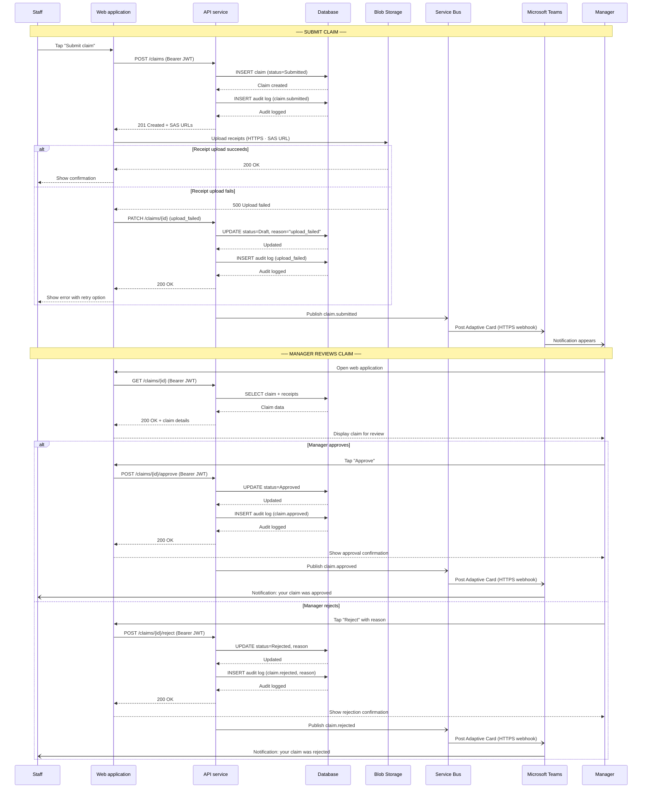

# Sequence — Submit and Approve a Claim

```mermaid
sequenceDiagram
    participant S as Staff
    participant CA as Web application
    participant API as API service
    participant DB as Database
    participant BLOB as Blob Storage
    participant SB as Service Bus
    participant T as Microsoft Teams
    participant M as Manager

    Note over S,M: ── SUBMIT CLAIM ──

    S->>CA: Tap "Submit claim"
    CA->>API: POST /claims (Bearer JWT)
    API->>DB: INSERT claim (status=Submitted)
    DB-->>API: Claim created
    API->>DB: INSERT audit log (claim.submitted)
    DB-->>API: Audit logged
    API-->>CA: 201 Created + SAS URLs

    CA->>BLOB: Upload receipts (HTTPS · SAS URL)

    alt Receipt upload succeeds
        BLOB-->>CA: 200 OK
        CA-->>S: Show confirmation
    else Receipt upload fails
        BLOB-->>CA: 500 Upload failed
        CA->>API: PATCH /claims/{id} (upload_failed)
        API->>DB: UPDATE status=Draft, reason="upload_failed"
        DB-->>API: Updated
        API->>DB: INSERT audit log (upload_failed)
        DB-->>API: Audit logged
        API-->>CA: 200 OK
        CA-->>S: Show error with retry option
    end

    API-)SB: Publish claim.submitted
    SB-)T: Post Adaptive Card (HTTPS webhook)
    T-)M: Notification appears

    Note over S,M: ── MANAGER REVIEWS CLAIM ──

    M->>CA: Open web application
    CA->>API: GET /claims/{id} (Bearer JWT)
    API->>DB: SELECT claim + receipts
    DB-->>API: Claim data
    API-->>CA: 200 OK + claim details
    CA-->>M: Display claim for review

    alt Manager approves
        M->>CA: Tap "Approve"
        CA->>API: POST /claims/{id}/approve (Bearer JWT)
        API->>DB: UPDATE status=Approved
        DB-->>API: Updated
        API->>DB: INSERT audit log (claim.approved)
        DB-->>API: Audit logged
        API-->>CA: 200 OK
        CA-->>M: Show approval confirmation
        API-)SB: Publish claim.approved
        SB-)T: Post Adaptive Card (HTTPS webhook)
        T-)S: Notification: your claim was approved

    else Manager rejects
        M->>CA: Tap "Reject" with reason
        CA->>API: POST /claims/{id}/reject (Bearer JWT)
        API->>DB: UPDATE status=Rejected, reason
        DB-->>API: Updated
        API->>DB: INSERT audit log (claim.rejected, reason)
        DB-->>API: Audit logged
        API-->>CA: 200 OK
        CA-->>M: Show rejection confirmation
        API-)SB: Publish claim.rejected
        SB-)T: Post Adaptive Card (HTTPS webhook)
        T-)S: Notification: your claim was rejected
    end
```
